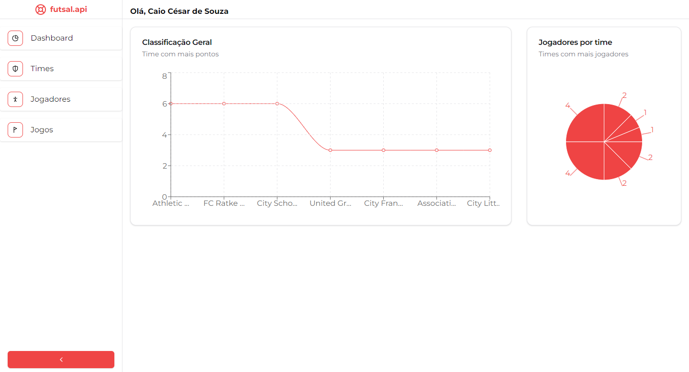
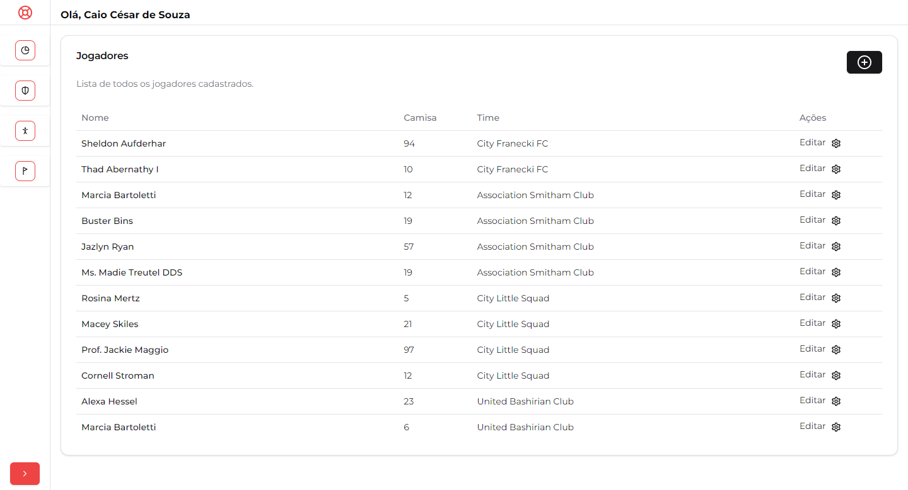
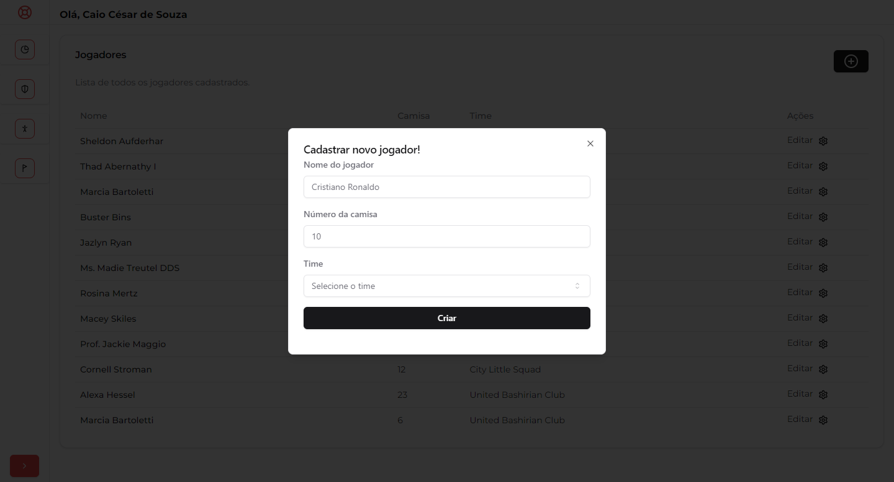
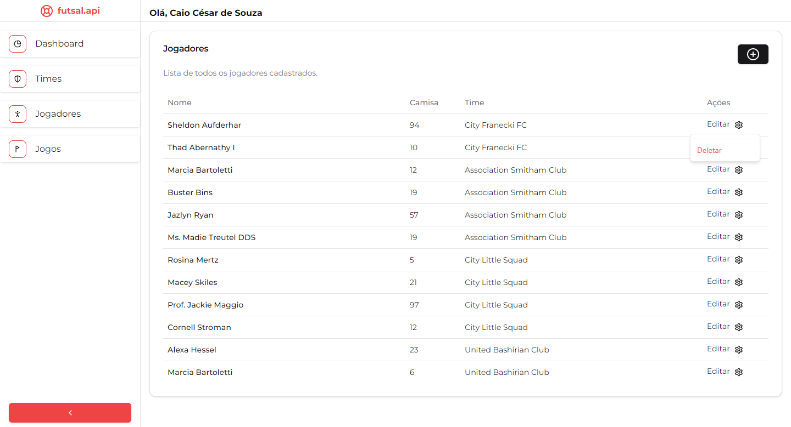

# Frontend que consome a API de futsal que fiz em laravel

## Stack: Next.js com TypeScript e Tailwind CSS

### Tela de login

### Tela de dashboard

### Tela de jogadores

### Tela de jogadores - Criando jogador

### Tela de jogadores - Deletando jogador

## Feito por Caio Souza 👨‍💻